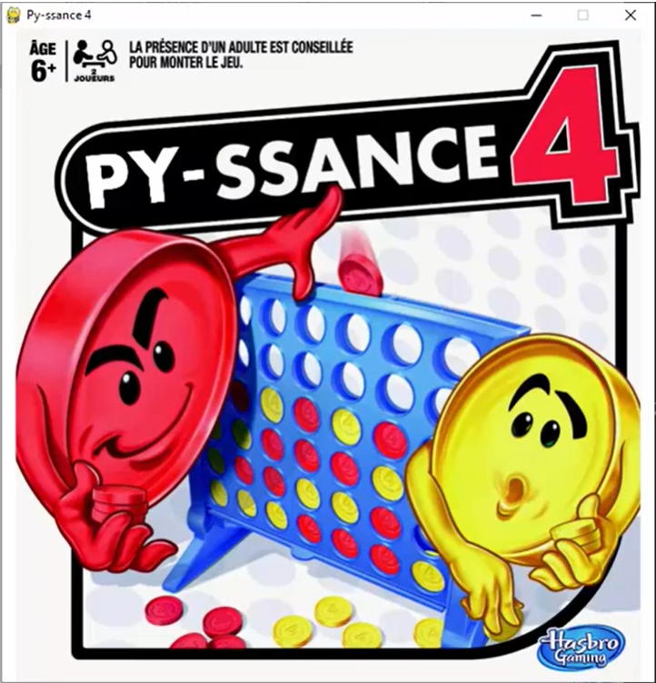

# 4inarowpy
4inarow in Python using PyGame

You will play against the computer. I.A. is based on a minmax algorithm.

Clic on the screenshots to see the video

Left / Right keys to move your token
Space to drop your token

To build this game on a windows platform, launch build.cmd
The game exe will be located in /dist

To launch this game in Python, you must first install the required librairies:
- pygame
- pytmx

The game main file is main.py

